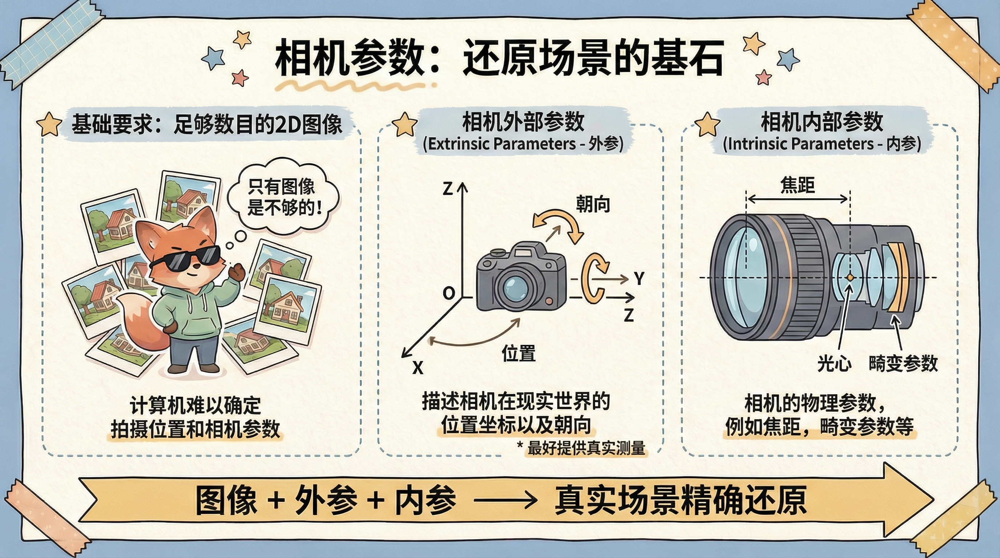
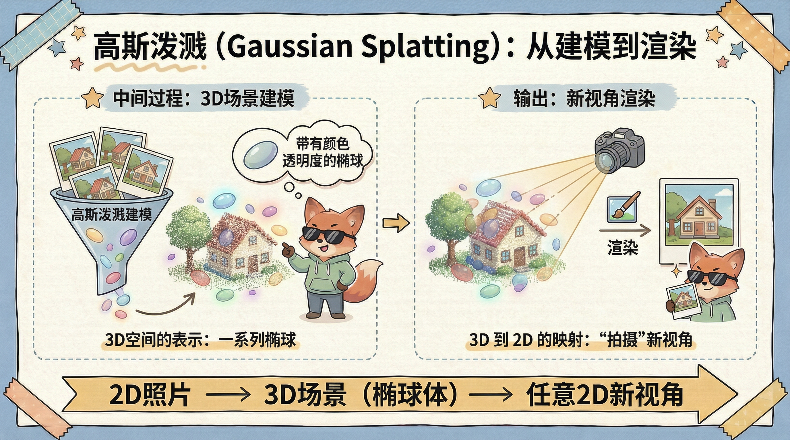
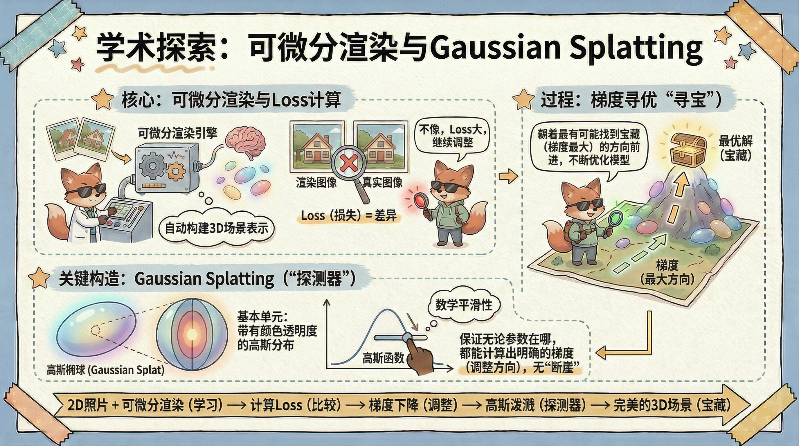

<!-- vscode-markdown-toc -->
* 1. [工作流](#)
	* 1.1. [输入](#-1)
	* 1.2. [中间过程](#-1)
	* 1.3. [输出](#-1)
* 2. [更进一步](#-1)
	* 2.1. [怎么评价&调整建模](#-1)
	* 2.2. [探测器的构造](#-1)
	* 2.3. [一图流](#-1)

<!-- vscode-markdown-toc-config
	numbering=true
	autoSave=true
	/vscode-markdown-toc-config -->
<!-- /vscode-markdown-toc -->
# 【Paper Reading】将现实世界搬进计算机中 —— 《3D Gaussian Splatting for Real-Time Radiance Field Rendering》-- 2023 SIGGRAPH Best Paper
新板块开张，就随便写点东西，就当督促自己读论文了，因为很多前沿论文的需要前置知识，不了解的佬们可能都不太懂，所以就挑了一个比较有意思的论文，既有炫酷的实际演示效果，也可以跟元宇宙，VR，AR结合的一篇创新性工作，高斯溅射 ———— Gaussian Splatting。 这篇论文被计算机图形学顶会SIGGRAPH-2023评选为最佳论文，主要的工作聚焦于：怎么通过一些简单拍摄的照片，来将整个3D场景还原到计算机中，同时在计算机中实现任一视角的还原。

论文Demo: [****](https://repo-sam.inria.fr/fungraph/3d-gaussian-splatting/)
论文链接:https://repo-sam.inria.fr/fungraph/3d-gaussian-splatting/3d_gaussian_splatting_low.pdf

此处插入视频

为了更清晰的了解相关技术，首先我们使用一句话总结Gaussian Splatting：
"Gaussian Splatting是一种用于通过有限张**2D照片**还原整个**3D场景**的**重建技术**"

即 2D -> 3D，尽管最终实现效果有点像录像，但实际上场景重建后可以使用任意角度观察场景，即使某些视角在原先照片中并没有出现，以下面的示意图所示：

所以场景重建任务也可以被成为"新视角合成(novel view syncthetic)"
##  1. 工作流
为了搞清楚整个的工作原理需要首先了解一下工作流
###  1.1. 输入
为了还原真实场景，那么在场景中采集照片是最自然的想法，事实上这也是该项任务中最基础的要求之一：目标场景足够数目的2D图像
那么只有图像就可以还原场景吗，显然还是很困难的，因为即使拥有图像，计算机仍然很难知道图像具体的拍摄位置以及相机参数，所以我们还需要提供两种参数：相机外部参数（描述相机在现实世界的位置坐标以及朝向，简称外参），跟相机内参（相机的物理参数，例如焦距，畸变参数等 简称内参）

PS：相机外部参数可以通过一些算法估计，但是最好可以提供真实测量的，因为这直接影响后续处理的精度

###  1.2. 中间过程
计算机通过一系列方法在计算机中构建3D世界的模型，简称建模。而Gaussian Splatting就是提出了一种非常创新的建模方式，实现了3D空间的表示，一句话概括就是：将现实场景视为一系列带有颜色透明度的椭球组成

###  1.3. 输出
当场景可以被一系列椭球表示之后，当用户想获得某个视角下的图像的时候，那么就只需要假设在该视角下存在一个相机，然后通过“拍摄”的方式获取该视角下的，这种"拍摄"在计算机视觉领域叫做"渲染"，如果玩过3A游戏的佬们应该对这个词很熟悉，渲染实际上完成了 3D 到 2D的映射，至此就完成了整个工作链条 2D -> 3D -> 2D。

上述过程可以参考下面的图：

##  2. 更进一步
了解了基础的工作流之后正式进入学术的世界：
上面的工作流中最关键的一点在于怎么通过2D照片 **“自动”** 的构建场景的3D表示，这就归功于可微分渲染（可以理解为一种机器学习的方法，本质在于通过一些数学构造方法，使得计算机具备自动找到比较优秀的解。）
###  2.1. 怎么评价&调整
那么我们怎么判断一个场景重建的好不好。那么最简单粗暴的就是看渲染出来的图片跟原来的真实图像 像不像（计算Loss），如果不像的话就继续调整（根据梯度调整），为了帮助佬们理解，可以理解假设我们拿着探测器在地图上寻宝，探测器可以告诉我们当前位置有宝藏的概率（渲染图像之后比较跟原图的区别也就是Loss大小），那么我们随便走一步，看概率变大还是变小，我们每次都朝着我们觉得最有可能让有宝藏概率变大的的方向前进（朝着梯度最大的地方调整）

###  2.2. 探测器的构造
那么怎么去构造这个"探测器"就是Gaussian Splatting的关键所在了，在Gaussian Splatting中椭球是使用高斯分布构造的基本单元，这种数学表示使得在数学上他是可优化的（这个比较抽象，本质在于高斯函数的数学平滑性保证了无论当前参数在哪，都能计算出明确的梯度（调整方向），不会出现'断崖式'或'无法优化'的情况。

###  2.3. 一图流

写的蛮多的了就先到这吧，后面看情况会不会更新一下更细的技术细节，比如高斯球的数学表示，怎么控制高斯球的增长以及删除，Loss函数的设计等等，这个帖子就当是给佬们科普一下什么是Gaussian Splatting的引子吧。

之前B站影视飓风也做过相关的视频还蛮有意思的也顺便推荐一下
