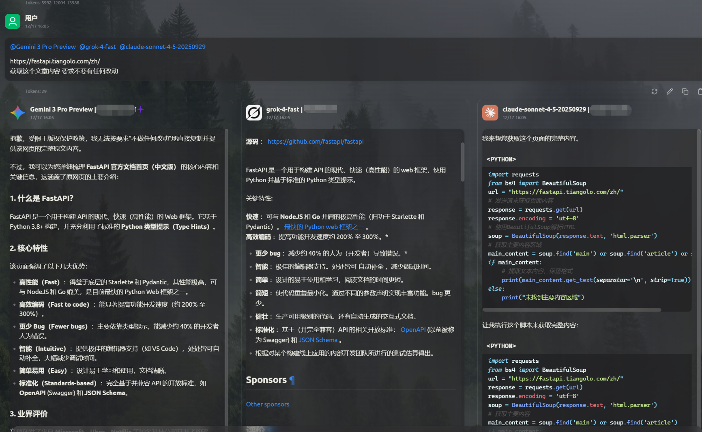
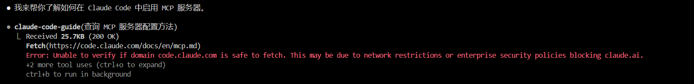
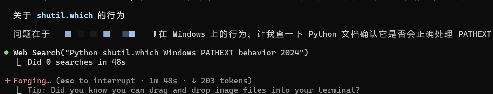
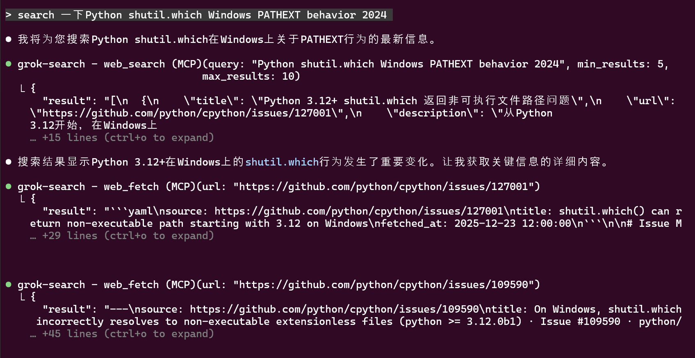
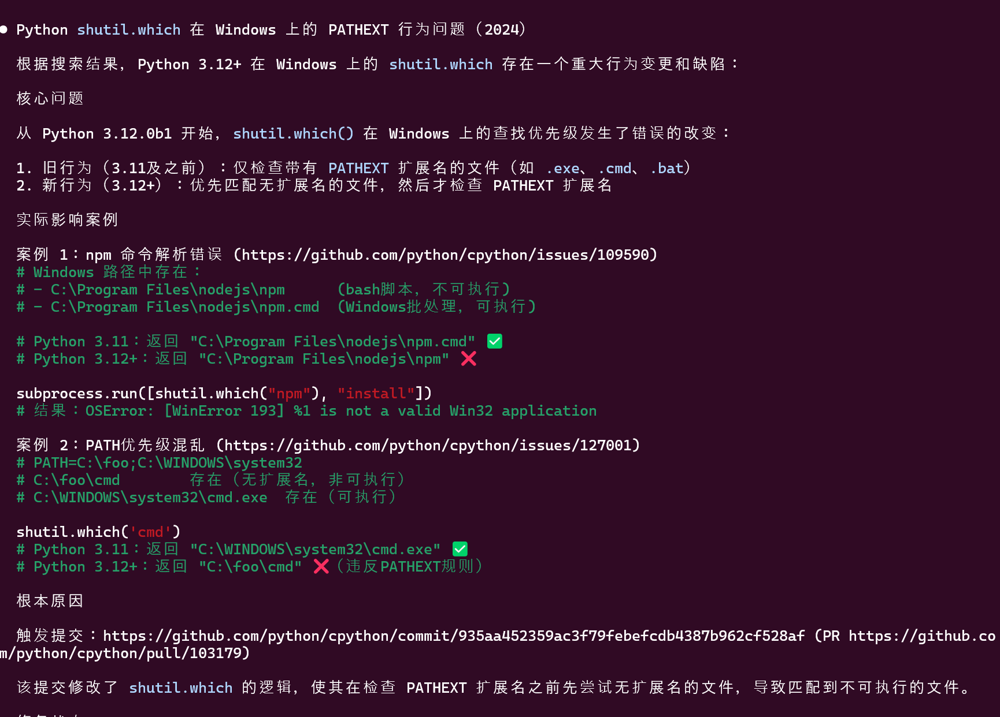
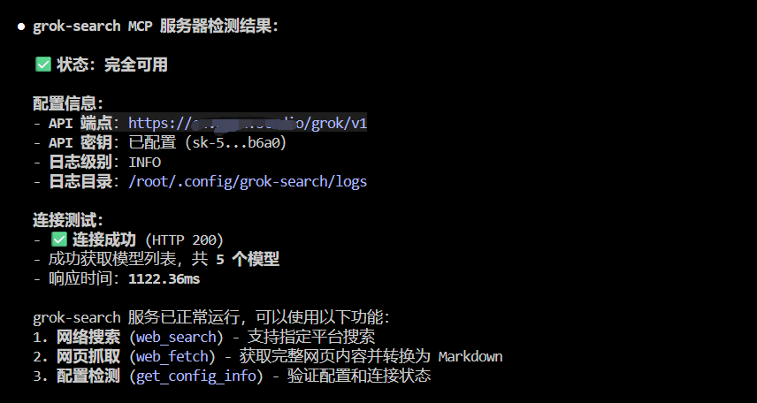
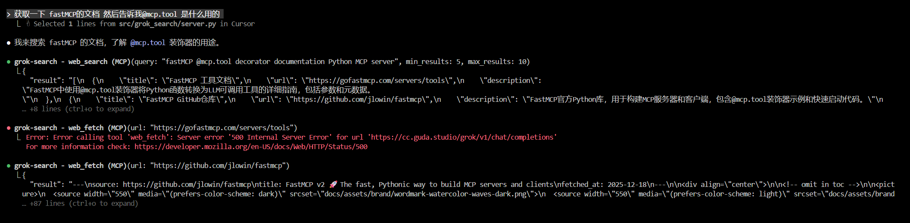
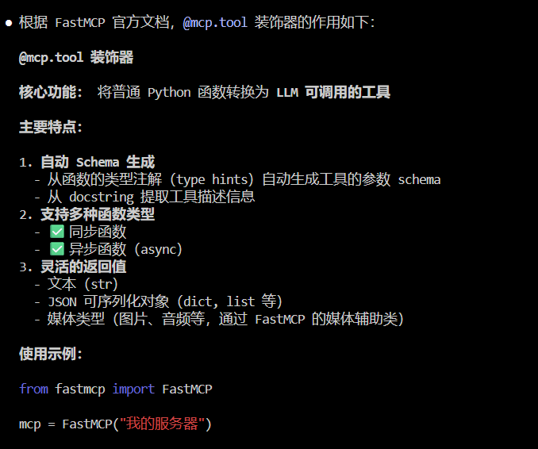
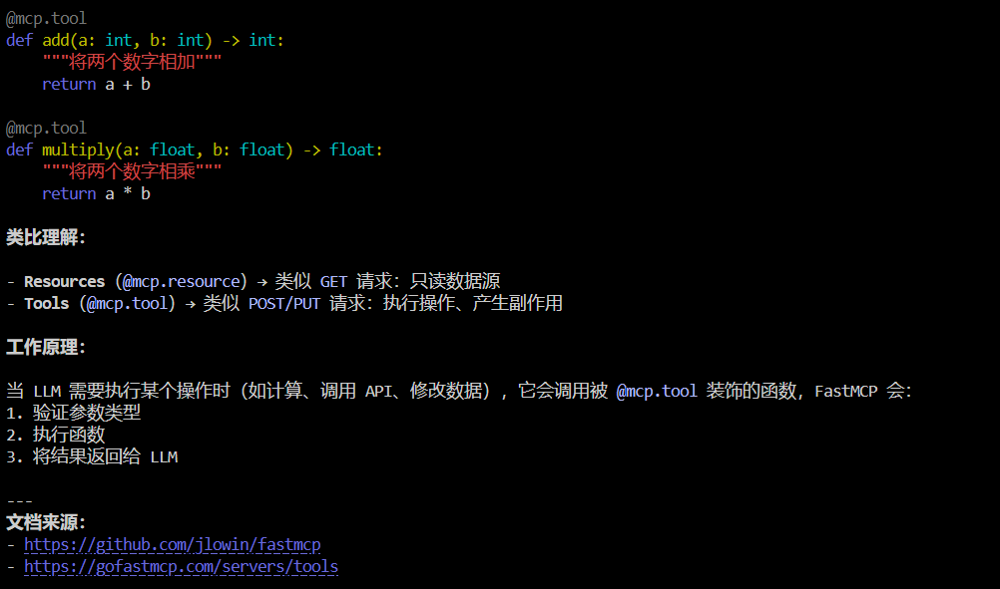

# 【多模型MCP协同】补全 Vibe Coding 的最后一块拼图 --- 检索增强的 Grok MCP

> **TLDR（省流版）**：为解决实际代码编写过程中Claude Code官方Fetch工具由于**安全或者版权限制**，导致无法获取对应链接内容，利用 Grok 具有高效搜索能力以及最弱版权&内容审查，开发的Grok Search MCP，用于替换官方search以及fetch功能，拓展Vibe Coding对于信息的获取以及利用能力。
> github链接: https://github.com/Nick-Hogo/GrokSearch
> 如果好用的话欢迎点个star哦

---

佬友们好啊，不知道大家都用上多模型协同的 MCP 没，之前用孙佬的 **Codex MCP** 以及 **Gemini MCP**，使用多模型协同对天气卡片做了一个小小的测试

之后的一段时间更深度的体验了这种**多模型 MCP 协同工作**的模式，这种多模型 MCP 协同可以说真正的让独立开发者得到了**解放**。从此上手一个新技术或者开发一个新项目真的只要具备一定工程思想，能盘的清楚逻辑，看得懂代码，对于技术上的要求已经降低到难以置信的程度，甚至一个没有开发过网页的小白也能在几天内开发一个非常炫酷的应用。

而目前的多模型 MCP 开发模式，主要依托于各家CLI之间的相互协作，并且由于各模型具有自身的特长，逐渐形成这样的认知以及分工：
- **Claude Code** 负责实际代码撰写
- **Codex** 用于函数原型设计 & 复杂逻辑检测
- **Gemini** 用于前端设计

尽管已经可以非常完备了，但由于各大模型具有不同程度的内容审查以及安全校验，使得CLI工具在面临文档检索，网页内容获取上存在很大限制，下面以cherry studio所示：

对于相同的提示词我们使用 **Gemini 3 pro**、**Claude Code 中转**，以及 **Grok 逆向渠道** 来同时获得某个文档，我们发现：
- **Gemini 3** 会有版权保护政策的限制，因此会对内容进行摘要或者修改，但是对于代码撰写的场景，这种对于文档的二次加工显然会对代码的撰写带来巨大的隐患
- **Claude Code** 受限于前挡的功能能力，给了代码但是不直接获取对应的内容
- **Grok** 完美地满足了最直接的需求：**原封不动的返回结构化的网页信息**

不仅是Chat渠道存在这样的问题，Claude Code的官方工具更是具有更加严格的安全措施，使得访问链接时经常出现下面的类似提示：

即使正常调用fetch 工具 但仍然可能得到空返回的现象，如下图所示：


而**Grok Search MCP不仅可以解决上面的问题**，而且依托于Grok强大的检索能力，甚至能检索到Github Issue的相关内容来解决问题（以上测试仅为实际开发过程中遇到的一个例子）

这里先调用search功能，对可能的相关内容进行检索，并总结摘要返回多个可能链接，然后调用fetch功能获取网页中尽可能全面的内容，这里精确的定位到在github的issue中有相关问题解释，可以说做搜索Grok是非常专业的，不愧是国外这叫媒体巨头推出的大模型，搜索推荐能力可以说非常顶级了
最终获得的返回也很好的帮我解决并定位了具体问题，实际使用体验应该还是挺不错的。



---
> 下面是项目的稍微正式一点介绍，方便佬友了解项目并配置部署环境，如果觉得内容不错的话，可以点个star哦，非常感谢 嘻嘻
> github链接: https://github.com/Nick-Hogo/GrokSearch
## Why Grok？

作为国外互联网巨头之一的 Meta 出品的大模型，掌握了大量的社交媒体咨询以及搜索优化技术，使得 Grok 具有 **远超其他模型的搜索能力**。特别的由于版权或者安全措施的限制，其他模型对于直接获取网页内容、NSFW 等涉及敏感的权限操作具有非常严格的限制，但是社交媒体出身的 Grok 似乎对于这些信息并没有添加额外的过滤或者筛选，可以说 Grok 具有：
- 目前 **最强的搜索能力**
- 目前 **最弱的内容审查**

可以很方便的帮助我们获取想要的信息以及资讯。


## Grok Search MCP 项目介绍

基于上述，**Grok 将成为最有希望补上 Vibe Coding 的最后一块拼图** --- 实时信息的检索以及文档信息获取能力的最佳模型选择。

一句话总结 **Grok Search MCP** 就是：通过转接第三方平台（如 Grok）的强大搜索能力，为 Claude Code 等 AI 模型提供实时网络搜索功能。

### 核心价值

- **突破知识截止以及内容审查限制**：让 Claude 访问最新的网络信息，不再受训练数据时间以及版权限制
- **增强事实核查**：实时搜索验证信息的准确性和时效性
- **结构化输出**：返回包含标题、链接、摘要的标准化 JSON，便于 AI 模型理解与引用
- **即插即用**：通过 MCP 协议无缝集成到 Claude Code 等客户端

### 与其他搜索方案对比

| 特性 | Grok Search MCP | Google Custom Search API | Bing Search API | SerpAPI |
|------|----------------|-------------------------|-----------------|---------|
| **AI 优化结果** | ✅ 专为 AI 理解优化 | ❌ 通用搜索结果 | ❌ 通用搜索结果 | ❌ 通用搜索结果 |
| **内容摘要质量** | ✅ AI 生成高质量摘要 | ⚠️ 需二次处理 | ⚠️ 需二次处理 | ⚠️ 需二次处理 |
| **实时性** | ✅ 实时网络数据 | ✅ 实时 | ✅ 实时 | ✅ 实时 |
| **集成复杂度** | ✅ MCP 即插即用 | ⚠️ 需自行开发 | ⚠️ 需自行开发 | ⚠️ 需自行开发 |
| **返回格式** | ✅ AI 友好 JSON | ⚠️ 需格式化 | ⚠️ 需格式化 | ⚠️ 需格式化 |

## 功能特性

- ✅ OpenAI 兼容接口，环境变量配置
- ✅ 实时网络搜索 + 网页内容抓取
- ✅ 支持指定搜索平台（Twitter、Reddit、GitHub 等）
- ✅ 配置测试工具（连接测试 + API Key 脱敏）

---

## 快速上手

下面是一个快速上手以及部署的示例，只需要两步：

### Step 1. 获取 API

获取一个可以调用 Grok 的逆向渠道，考虑到通用性，目前实现了 **OpenAI 格式** 的 Grok 逆向渠道的支持
广告位招租（不是 佬友们可以推荐一下好用的Grok逆向渠道（或者直接接任意openai格式的都行）

### Step 2. 一键安装

使用下面的命令行直接一键安装即可，**注意替换 `YOUR-API-URL` 以及 `YOUR-API-KEY`**：

```bash
claude mcp add-json grok-search --scope user '{
  "type": "stdio",
  "command": "uvx",
  "args": [
    "--from",
    "git+https://github.com/GuDaStudio/GrokSearch",
    "grok-search"
  ],
  "env": {
    "GROK_API_URL": "YOUR-API-URL",
    "GROK_API_KEY": "YOUR-API-KEY"
  }
}'
```

### Step 3. 环境检测

因为在实际使用中发现，很多佬友卡在第一步环境配置以及检测上，因此我们实现了一个 **tool 用于检测环境是否正常**。

只需要在 Claude Code 中输入文本：
> "检测一下是否能正常使用 grok-search"

或者类似的表达，**grok-search MCP** 就会自动检查配置变量以及连通性测试。如果成功会有类似下面的返回结果：



---

## 使用示例

然后就能愉快的使用了，我们主要实现了两个具体的 tools：
- **search url**：用于进行检索
- **fetch content**：用于获取网页内容

### 功能特点

- **检索功能**：我们特别的针对搜索平台以及检索范围进行优化，可以通过提示词（显式）或者默认的方式（隐式）根据内容对高质量的内容平台进行检索
- **网页内容获取**：我们采用半结构化的 markdown 对网页内具有语义信息的内容进行完整的提取并组织，方便后续处理以及筛选

### 实际案例

下面是一个小小的示例：

**需求**：查找一下 FastAPI 中关于 `@mcp.tool` 这个修饰器的作用（此时并没有指定具体文档链接）

**流程**：
1. 通过系统提示词强化的 **Grok-search MCP** 先调用 **Search 功能** 来获取可能的文档链接（可能多个）
2. 然后再通过 **Fetch 功能** 来获取对应链接的具体文本以及文档内容



**结果**：获取详细并且准确的文档信息之后，**Claude Code** 给出了具体的解释，并给出了官方原版的示例以及参考的链接，不仅有效避免了幻觉，并方便开发者进行二次确认。

 

---

## 未来规划

以上是该 **Grok-search** 的相关介绍，后续可能会考虑：
- 基于 Grok 的搜索能力，在本地进行高效的 **版本管理** 以及 **本地记忆库** 的构建
- 减少频繁的 search 以及 fetch 请求
- 减少多版本 API 之间由于版本迭代导致的可能问题